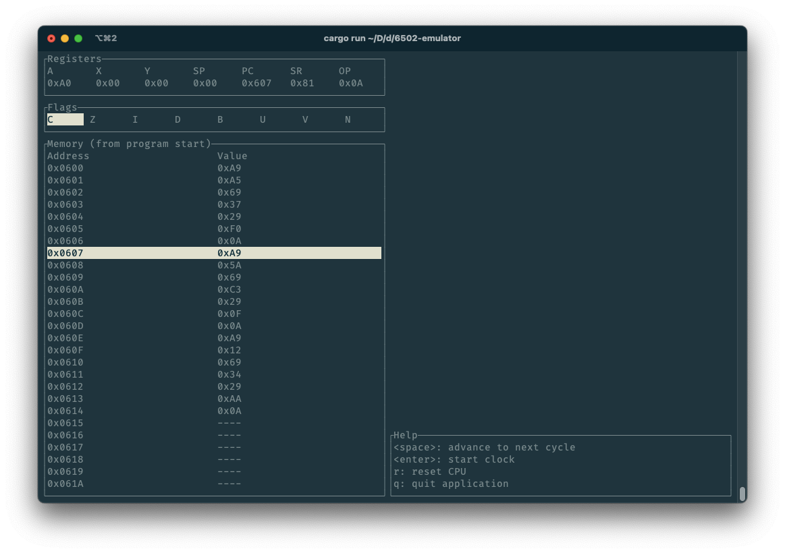

# 6502 emulator

## To do

### Backend

- [x] Implement all addressing modes
- [ ] Test all addressing modes
    - [x] IMP
    - [ ] REL
    - [ ] ACC
    - [x] all others
- [ ] Implement all instructions (DOING)
    - [x] ADC
    - [x] AND
    - [ ] ASL
    - [x] BCC
    - [x] BCS
    - [x] BEQ
    - [x] BIT
    - [x] BMI
    - [x] BNE
    - [x] BPL
    - [x] BRK
    - [x] BVC
    - [x] BVS
    - [x] CLC
    - [x] CLD
    - [x] CLI
    - [x] CLV
    - [x] CMP
    - [x] CPX
    - [x] CPY
    - [x] DEC
    - [x] DEX
    - [x] DEY
    - [x] EOR
    - [x] INC
    - [x] INX
    - [x] INY
    - [x] JMP
    - [ ] JSR
    - [x] LDA
    - [x] LDX
    - [x] LDY
    - [ ] LSR
    - [x] NOP
    - [x] ORA
    - [x] PHA
    - [x] PHP
    - [x] PLA
    - [x] PLP
    - [ ] ROL
    - [ ] ROR
    - [x] RTI
    - [x] RTS
    - [x] SBC
    - [x] SEC
    - [x] SED
    - [x] SEI
    - [x] STA
    - [x] STX
    - [x] STY
    - [x] TAX
    - [x] TAY
    - [x] TSX
    - [x] TXA
    - [x] TXS
    - [x] TYA
    - [x] XXX
- [ ] Test all instructions
- [ ] Count cycles

### Frontend

- [ ] Create simple CLI for basic functionality
- [ ] Read from ROM files
- [ ] TUI (DOING)
    - [x] Registers
    - [x] Flags
    - [ ] Memory
        - [x] View memory
        - [ ] Scroll memory
        - [ ] Edit memory
        - [ ] View stack
    - [ ] Port to `ratatui`
    - [ ] Display (for NES PPU)
    - [ ] Menus (to emulation mode)
    - [ ] Theming
        - FIXME: highlighted table row only works in terminal dark mode

## Specific system emulation

- 0xFFFA-0xFFFB: NMI interrupt vector
- 0xFFFC-0xFFFD: reset vector
- 0xFFFE-0xFFFF: IRQ interrupt vector

### Nintendo Entertainment System / Famicom

See [NESdev Wiki](https://www.nesdev.org/wiki/Nesdev_Wiki) for more.

#### CPU memory map

- 0x0000-0x07FF: 2KB internal RAM (as used in Bus.rs)
- 0x0800-0x1FFF: mirrors of internal RAM
- 0x2000-0x2007: PPU registers
- 0x2008-0x3FFF: mirrors of PPU registers
- 0x4000-0x4017: APU and I/O registers
- 0x4018-0x401F: normally disabled (APU and I/O functionality)
- 0x4020-0xFFFF: cartridge space (PRG ROM/RAM and mapper registers, incl. reset and IRQ vector)

##### CPU-PPU registers

8 registers from 0x2000 to 0x2007, mirrored beyond that.

- 0x2000: PPUCTRL
- 0x2001: PPUMASK
- 0x2002: PPUSTATUS
- 0x2003: OAMADDR
- 0x2004: OAMDATA
- 0x2005: PPUSCROLL
- 0x2006: PPUADDR
- 0x2007: PPUDATA
- 0x4014: OAMDMA

#### PPU memory map

- 0x0000-0x1FFF: pattern memory ("CHR ROM")
- 0x2000-0x3EFF: nametable memory ("VRAM")
- 0x3F00-0x3FFF: palette memory
