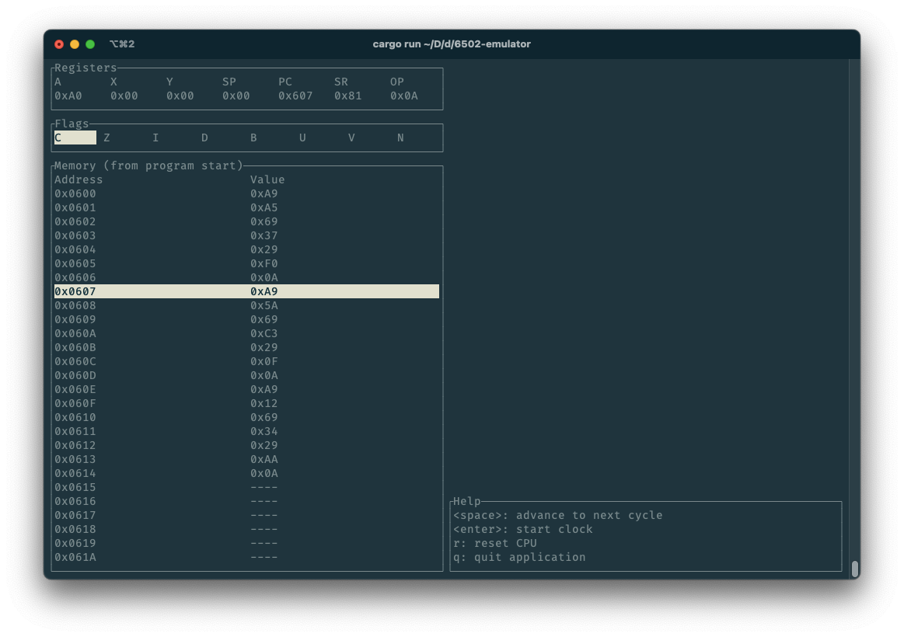

# 6502 emulator

> Please note that this is just a project for me to learn Rust and how the 6502 works. You can use this software, as-is. Feel free to submit issues and/or contribute, but don't expect too much.

## Roadmap

### Backend

#### Core

- [x] Implement all addressing modes
- [x] Test all addressing modes
- [ ] Implement all instructions
    - [ ] SBC
    - [ ] Handle over/underflow in branching instructions
- [ ] Test all instructions
- [ ] Interrupts
    - [x] BRK
    - [ ] IRQ
    - [ ] NMI
- [ ] Test all opcodes
- [ ] Count cycles

#### IO

- [ ] Read plaintext files
- [ ] Read ROM files
    - [ ] Custom, minimal format
    - [ ] iNES
    - [ ] NES2.0

#### NES

- [ ] PPU
- [ ] APU
- etc.

### Frontend

- [ ] TUI
    - [x] Registers
    - [x] Flags
    - [ ] Memory
        - [x] View memory
        - [ ] Scroll memory
        - [ ] Edit memory
        - [ ] View stack
    - [x] Port to `ratatui`
    - [ ] Display
    - [ ] Menus
    - [ ] Theming
- [ ] API

## Specific system emulation

- 0xFFFA-0xFFFB: NMI interrupt vector
- 0xFFFC-0xFFFD: reset vector
- 0xFFFE-0xFFFF: IRQ interrupt vector

### Nintendo Entertainment System / Famicom

See [NESdev Wiki](https://www.nesdev.org/wiki/Nesdev_Wiki) for more.

#### CPU memory map

- 0x0000-0x07FF: 2KB internal RAM (as used in Bus.rs)
- 0x0800-0x1FFF: mirrors of internal RAM
- 0x2000-0x2007: PPU registers
- 0x2008-0x3FFF: mirrors of PPU registers
- 0x4000-0x4017: APU and I/O registers
    - 0x4016 and 0x4017 read controller 1 and 2 (respectively), bit by bit
- 0x4018-0x401F: normally disabled (APU and I/O functionality)
- 0x4020-0xFFFF: cartridge space (PRG ROM/RAM and mapper registers, incl. reset and IRQ vector)

##### CPU-PPU registers

8 registers from 0x2000 to 0x2007, mirrored beyond that.

- 0x2000: PPUCTRL
- 0x2001: PPUMASK
- 0x2002: PPUSTATUS
- 0x2003: OAMADDR
- 0x2004: OAMDATA
- 0x2005: PPUSCROLL
- 0x2006: PPUADDR
- 0x2007: PPUDATA
- 0x4014: OAMDMA

#### PPU memory map

- 0x0000-0x1FFF: pattern memory ("CHR ROM")
- 0x2000-0x3EFF: nametable memory ("VRAM")
- 0x3F00-0x3FFF: palette memory
